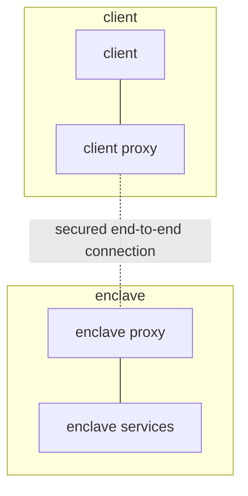
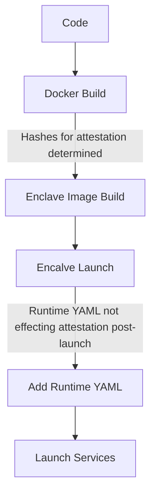
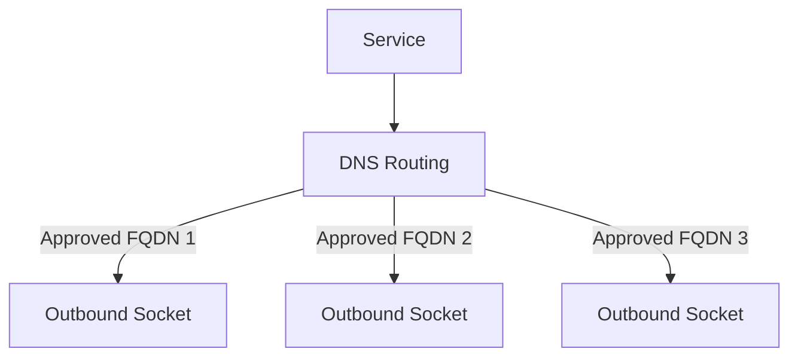

# MPC Encalve Applications with FastAPI :rocket:

What we'll cover in this tutorial:
- developing with oblivious (OBLV) and fastapi
    - recieving inputs from clients
    - runtime arguments
    - outbound calls
- local testing
    - unit tests
- configuring, deploying and connecting
    - configure repo to be valid service
    - create client keys
    - deploy to enclave
    - connect to and interact with the enclave application 

## 1. Understanding OBLV Architecture for MPC :classical_building:

## 2. Attestation & Runtime Args :runner:

## 3. Outbound Calls :mega:

